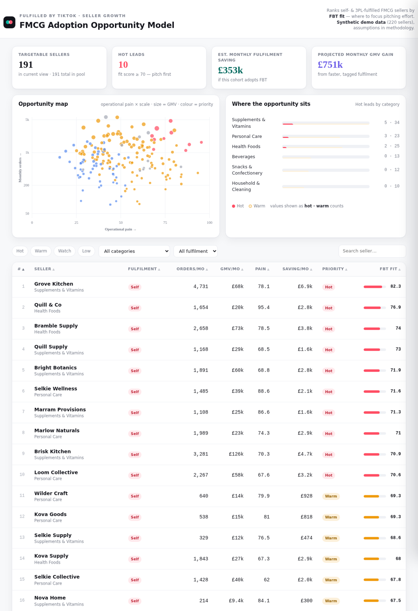

# FBT Adoption Opportunity Model — FMCG

An analytics prototype that ranks **Fast-Moving Consumer Goods (FMCG)** sellers on TikTok Shop
by how strong a candidate they are for **Fulfilled by TikTok (FBT)** — so a Seller Growth team
knows exactly who to pitch first, and with what numbers.

**[▶ Live dashboard](https://dharshinibhaskaranworkid-oss.github.io/fbt-dashboard/)** — Click here to view the Dashboard



---

## The problem this solves

FBT is TikTok's Amazon-FBA-style logistics program: sellers send stock to a TikTok warehouse and
TikTok stores, picks, packs and ships it. For the Seller Growth team, the daily question is
*which of thousands of self- or 3PL-fulfilled sellers should we spend limited time convincing to switch?*

This tool answers that with a repeatable score instead of gut feel, and produces a ready-to-use
pitch (cost saving + projected GMV uplift) for each seller.

## How the model works

Every non-FBT seller gets an **FBT fit score (0–100)** blending three levers the team actually cares about:

| Component | Weight | Intuition |
|---|---|---|
| **Operational pain** | 35% | Late-dispatch, cancellations and slow delivery = the most to *gain* by switching |
| **Scale (volume)** | 30% | Log-scaled monthly orders — bigger books are worth more effort |
| **Margin headroom** | 20% | Can they absorb FBT fees and still profit? |
| Base fit | 15% | — |

Two hard gates:
- **Eligibility:** parcels over **30 kg / 31.5 L** are flagged ineligible (TikTok Shop UK FBT limit).
- Sellers **already on FBT** are excluded from the target pool.

Each seller also gets a **cost/benefit projection**: estimated per-order saving (~28%, mid of the
public 20–35% FBT range) and a pain-scaled volume uplift capped at **+30%**, benchmarked to TikTok's
own UK FBT pilot (a pilot brand reported volumes +30%, lead times −36%, late-dispatch −45%).

Sellers are then banded **Hot ≥70 · Warm ≥50 · Watch ≥30 · Low**.

## What's in here

```
index.html         Self-contained interactive dashboard (no backend, no build step)
generate_data.py   Generates the synthetic dataset + scoring model (seeded, reproducible)
sellers.csv        The scored dataset (220 sellers)
```

The dashboard has: KPI summary, an **opportunity map** (pain × volume, dot size = GMV, colour = priority),
a category breakdown, a filterable/sortable **priority leaderboard**, and a **pitch drawer** per seller
with the score breakdown, cost/benefit, and a suggested pitch angle.

## Run it

Just open `index.html` — everything is inlined. To regenerate the data:

```bash
python3 generate_data.py    # writes sellers.csv + sellers.json
```

## Deploy the live link (GitHub Pages, free)

1. Create a repo and push these files.
2. **Settings → Pages → Build from branch → `main` / root.**
3. Your dashboard is live at `https://YOUR-USERNAME.github.io/REPO-NAME/`.

## Honest caveats

All sellers, brands and figures are **synthetic** — generated to be realistic, not real TikTok data.
The scoring weights and cost assumptions are my own, documented above so they can be challenged and tuned.
With real seller data the same pipeline would run unchanged.
